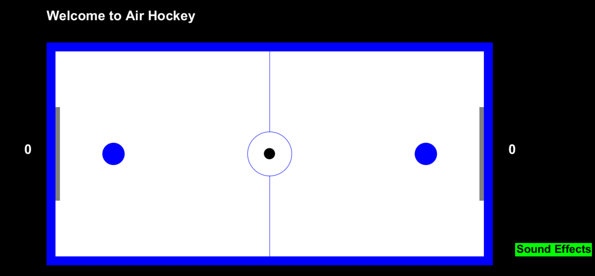

# SCC110-AirHockey - 38727242

A two-player Air Hockey game.

Using separate keybinds, players enjoy and interact with a fully functional 
air hockey table. (Along with some cheats).

Features Include:
- Left mallet is controlled using the W, A, S, and D keys.
- Right mallet is controlled using the arrow keys (up, down, left, right). 
- Pressing the M key mutes or unmutes the game's sound effects.

Cheats Included: 
- Pressing the Shift + I key increases the size of the mallets.
- Pressing the Shift + O key increases the speed of the mallets.
- Pressing the Shift + P key changes the color of the game table.
- Pressing the Shift + R key resets all the cheats.

This repository contains the following files for the SCC.110 project "Air Hockey" (Project 2 in 2022/23):

**Java classes (.java files)**
+ Ball.java
+ GameArena.java
+ Line.java
+ Rectangle.java
+ Text.java
+ Cheats.java
+ CreateScreen.java
+ KeyboardInputs.java
+ TableManager.java
+ SoundPlayer.java
+ Driver.java

**Sound effects (.wav files)**
+ applause.wav
+ bounce.wav
+ drumroll.wav
+ fanfare.wav
+ hit.wav

The folder **\docs** contains JavaDoc documentation. Click on *allclasses-index.html* to access the documentation.